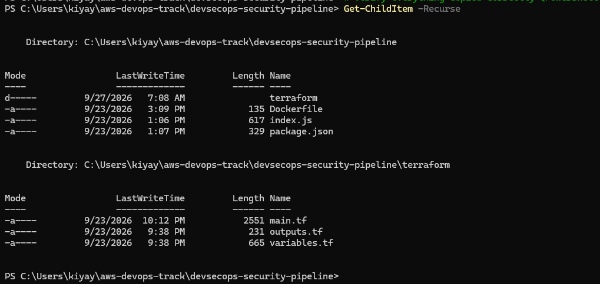
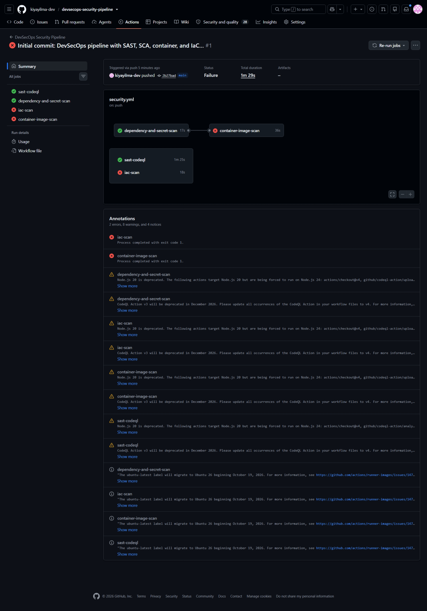
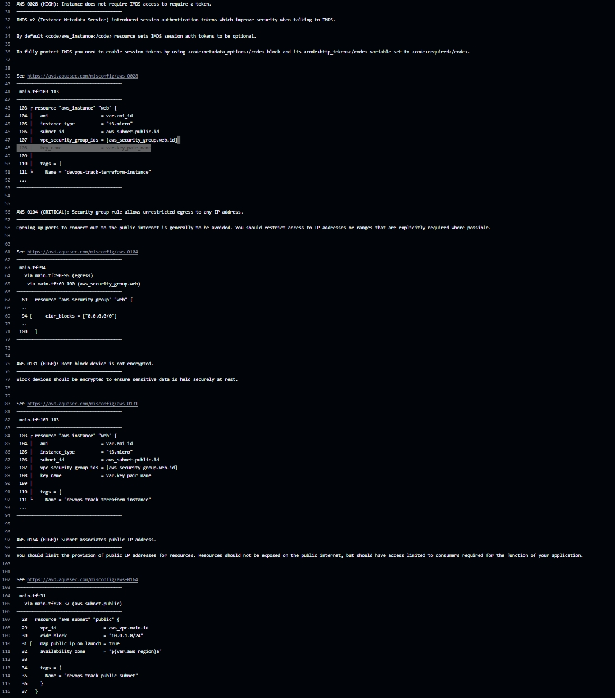
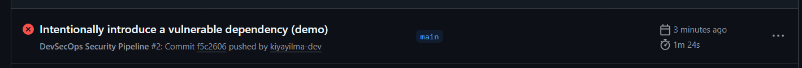
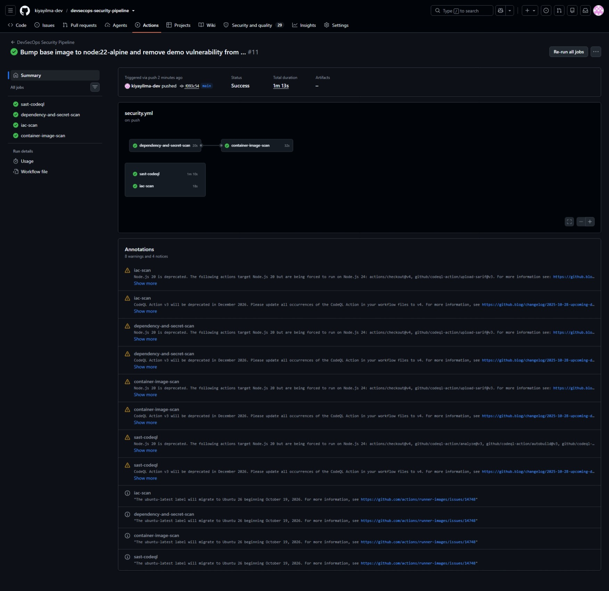

# DevSecOps Security Automation Pipeline


A four-layer security pipeline that scans code, dependencies, container images, and infrastructure on every push — and actually **blocks** the build on HIGH/CRITICAL findings instead of just reporting on them. Every finding below was real, investigated, and resolved with either a genuine fix or a documented, justified suppression — not blanket-ignored to make the dashboard green.

## 📐 Architecture

```
                     git push
                        │
                        ▼
        ┌───────────────┼───────────────┬───────────────┐
        ▼               ▼               ▼               ▼
   sast-codeql   dependency-and-   container-image-    iac-scan
   (CodeQL)      secret-scan       scan                (Trivy config)
                 (Trivy fs)        (Trivy image)
        │               │               │               │
        └───────────────┴───────┬───────┴───────────────┘
                                 ▼
                    SARIF uploaded per job, each
                    with its own category
                                 │
                                 ▼
                  GitHub Security → Code scanning tab
                                 │
                                 ▼
              Build fails (exit-code 1) on any
                   HIGH/CRITICAL finding
```

## 🖼️ Screenshots

**1. Project Setup: Files copied and structured correctly**


**2. Initial Pipeline Run: Catching real IaC and Container vulnerabilities on first push**


**3. IaC Scan Details: Trivy flagging the open SSH security group (exit code 1)**


**4. Quality Gate Proven: Deliberately vulnerable dependency (`lodash`) blocking the build**


**5. Final State: All four jobs (SAST, SCA, Container, IaC) passing successfully after remediation**


## 🗂️ Project Structure

```
devsecops-security-pipeline/
├── .github/
│   └── workflows/
│       └── security.yml       # 4-job pipeline: SAST, SCA, container, IaC
├── terraform/
│   ├── main.tf                # Reused/hardened infra config
│   ├── variables.tf
│   └── outputs.tf
├── index.js                   # Demo Express app (scan target)
├── package.json
├── Dockerfile
└── .trivyignore                # Documented vulnerability suppressions
```

## 🛠️ Tech Stack

| Layer         | Tool                        | What It Catches                                          |
| ------------- | --------------------------- | -------------------------------------------------------- |
| SAST          | GitHub CodeQL               | Exploitable code patterns (injection, unsafe eval, etc.) |
| SCA / Secrets | Trivy (filesystem scan)     | Vulnerable dependencies, leaked credentials in source    |
| Container     | Trivy (image scan)          | Vulnerable OS packages baked into the built image        |
| IaC           | Trivy (config scan)         | Terraform misconfigurations                              |
| Reporting     | SARIF → GitHub Security tab | Unified, triaged findings across all four tools          |

## ✅ Proven, Not Just Installed

A security pipeline that never fails hasn't proven anything. Three real findings were investigated and resolved here — each one differently, on purpose:

**1. Terraform — unrestricted egress (AVD-AWS-0104, CRITICAL)**
Flagged because the security group's HTTP/HTTPS egress rules allow `0.0.0.0/0`. Restricting outbound destinations for general internet access (package mirrors, Docker Hub, GitHub) is impractical — so this was a **documented risk acceptance**, not a forced fix:

```hcl
# Outbound HTTP/HTTPS to 0.0.0.0/0 is intentional: this instance needs to
# reach package registries, Docker Hub, and GitHub over the open internet.
# Destination IPs for these services are broad and change constantly, so
# restricting egress here is impractical. Risk accepted; ingress remains
# locked down to specific IPs.
#trivy:ignore:AVD-AWS-0104
resource "aws_security_group" "web" {
```

**2. Dependency scan — deliberately broken, then fixed**
To prove the gate actually blocks bad code (not just reports on it), a known-vulnerable `lodash` version was intentionally added to `package.json`, committed, and pushed. The `dependency-and-secret-scan` job failed immediately (`exit-code 1`), visible in the Actions run and the GitHub Security tab. It was then removed and the pipeline went green — a real before/after, not a hypothetical.

**3. Container image — inherited CVEs from npm's own bundled tooling**
The built image initially failed on 8 HIGH-severity CVEs — none in the application's own dependencies (which scanned clean), but inside `npm`'s internal tooling, bundled into the base image. Two things fixed this:

- Bumped the base image (`node:20-alpine` → `node:22-alpine`) with an `apk upgrade` for current OS packages.
- Suppressed the remaining CVEs, which live in npm's internals and are never invoked at container runtime, via `.trivyignore` with a documented justification — the same discipline as the Terraform finding, applied to a different scanner.

## ▶️ How to Run This

```bash
# Local dependency/secret scan
trivy fs --scanners vuln,secret --severity HIGH,CRITICAL .

# Local container image scan
docker build -t devsecops-demo-app:scan .
trivy image --severity HIGH,CRITICAL --format table devsecops-demo-app:scan

# Local Terraform scan
trivy config --severity HIGH,CRITICAL --format table ./terraform
```

On every `git push` to `main`, all four checks run automatically via `.github/workflows/security.yml`.

## 🔑 Key Learnings

- **SAST vs. SCA vs. container vs. IaC scanning** are four genuinely different attack surfaces, not the same check run four times — each layer caught things the others couldn't.
- **Quality gates as enforcement, not just reporting** — `--exit-code 1` is what turns a scanner into a gate; proved it with a real, deliberate failing build.
- **Remediate vs. document-and-accept** — learned to tell the difference between a finding that needs a code fix and one that needs a justified suppression, and to make that decision explicit in code (`#trivy:ignore:...` and `.trivyignore`) rather than silently overriding the tool.
- **SARIF categories matter** — uploading results from three separate Trivy runs to the same GitHub Security tab without distinct `category:` values caused stale findings to persist across scans; each upload needs its own category to be tracked independently.
- **Debugging CI/local mismatches methodically** — when a scan result didn't match expectations, traced it back to the actual checked-out commit and confirmed the Dockerfile change had never been committed, rather than assuming the scanner was wrong.

## 🚧 Future Improvements

- [ ] Add a scheduled (not just push-triggered) scan to catch newly disclosed CVEs in unchanged code
- [ ] Wire SARIF severity summaries into a Slack/email notification
- [ ] Add license scanning as a fifth layer
- [ ] Periodically review `.trivyignore` entries as the base image is upgraded

## 👨‍💻 Author

**Kiya Yilma Regasa**
Cloud & DevOps Engineer

[GitHub](https://github.com/kiyayilma-dev)
